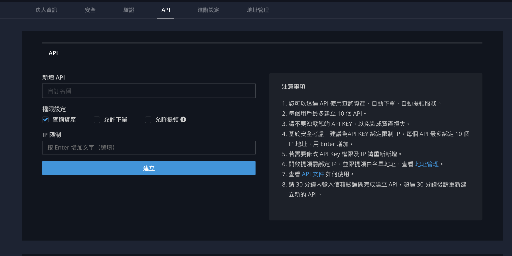

# Change Log
| Date       | Version | Description                                                                                                                                                                                       |
| :--------- | :------ | :------------------------------------------------------------------------------------------------------------------------------------------------------------------------------------------------ |
| 2023/09/08 | v3.5.10 | Add ignoreTimeLimitEnable for [List Orders Data](./api/v3/private/get_orders_data.md) and API documentation structure adjustment.|
| 2023/09/08 | v3.5.10 | Update [Get Currency Info](./api/v3/public/get_currency_info.md) api response with currency protocol and depositConfirmation  |
| 2023/09/08 | v3.5.10 | Increase CreateOrder & BatchCreateOrders & CancelOrder & CancelAllOrders API rate limit                                                                                                           |
| 2023/09/08 | v3.5.10 | Add [History Order Ws Stream](./ws/private/history_orders_stream.md)  |
| 2023/03/28 | v3.5.9  | Add 50 limit for [OrderBook API](restful-api_V3.md/#get-orderbook-data) and [OrderBook WS](web-socket-api_V3.md/#orderbook-stream)                                                                |
| 2022/05/23 | v3.5.8  | Add BSC Protocol for [Withdrawal API](restful-api_V3.md/#create-withdraw-invoice)                                                                                                                 |
| 2022/04/28 | v3.5.7  | Add Percent for [CreateOrder API](restful-api_V3.md/#create-an-order)                                                                                                                             |
| 2022/03/15 | v3.5.6  | Add ClientID for [CreateOrder API](restful-api_V3.md/#create-an-order)                                                                                                                            |
| 2022/02/16 | v3.5.5  | Add [Private Websocket Stream](web-socket-api_V3.md/#private-websocket-stream).                                                                                                                   |
| 2021/12/23 | v3.5.4  | Add [All Trades](restful-api_V3.md/#) auth api.                                                                                                                                                   |
| 2021/12/23 | v3.5.4  | [Cancel multiple orders](restful-api_V3.md/#cancel-batch-orders) and [Cancel all orders](restful-api_V3.md/#cancel-all-orders) to allow `1` requests per second per IP.                           |
| 2021/04/13 | v3.5.3  | Post-only added to [Create Order](restful-api_V3.md/#create-an-order) and [Create batch limit/market orders](restful-api_V3.md/#create-batch-orders) . New order `status` 6 for post-only cancel. |
| 2021/01/21 | v3.5.2  | [All Orders](restful-api_V3.md/#list-orders-data), parameter change. `statusKind` `Done` only include status 2 and 3. New parameter `status` added to retrieve single specified `status`.         |
| 2021/01/05 | v3.5.1  | Support [All Orders](restful-api_V3.md/#list-orders-data), deprecated Order List                                                                                                                  |
| 2020/05/19 | v3.5.0  | Support [Withdraw](restful-api_V3.md/#create-withdraw-invoice) and [Withdraw status](// todo put link) API                                                                                        |
|            |         | Support [Create batch limit/market orders](restful-api_V3.md/#create-batch-orders)                                                                                                                |
| 2020/03/31 | v3.3.0  | Support [Cancel all](restful-api_V3.md/#cancel-all-orders) and [Cancel batch](restful-api_V3.md/#cancel-batch-orders) APIs                                                                        |
| 2019/11/19 | v3.0.0  | Add support for Stop Limit orders. Stop Limit order fields added to all related API response.                                                                                                     |
|            |         | Add `feeSymbol` in [Get order list](restful-api_V3.md/#list-orders-data) is now in lowercase                                                                                                      |
|            |         | Removed Get order history API                                                                                                                                                                     |
|            |         | Removed Get ticker API                                                                                                                                                                            |
|            |         | Add `tradable` to [Get the account balance](restful-api_V3.md/#get-user-balance) API                                                                                                              |

# Table of Content
*   [Getting Started](#getting-started)
    *   [API Key Setup](#api-key-setup)
        *   [Web Create Api Key SOP](#web-create-api-key-sop)
        *   [API Security](#authentication)
        *   [API Example Scripts](#api-example-scripts)
    *   [API Library](#api-library)
        *   [Golang](#golang)
        *   [Python](#python)
        *   [Trade Tools SDK (免責)](./LICENSE)
*   [API General Info](#api-general-info)
    *   [General API Information](#general-info)
        *   [API Endpoint & Versioning](#api-endpoint)
        *   [API Version List](#api-version-list)
        *   [API Rate Limit](#api-rate-limit)
        *   [HTTP Status Code & Error Response](#http-status-code--error-response)
    *   [Order Operation Introduction](./order.md)
    *   [Data Model Information](./model.md)
*   [Restful API List](#restful-api-list)
    *   [Public API List](#public-restful-api)
        *   [Market Data Endpoints](#market-data-endpoints)
    *   [Private API List](#private-restful-api)
        *   [Order Endpoints](#order-endpoints)
        *   [Account Endpoints](#account-endpoints)
        *   [Wallet Endpoints](#wallet-endpoints)
*   [Websocket Stream List](#websocket-stream-list)
    *   [Public Websocket Stream List](#public-websocket-stream)
    *   [Private Websocket Stream List](#private-websocket-stream)
*   [Contact Us](#contact-us)
    *   [Support](#support)
    *   [FAQ](#faq)

# Getting Started

## API Key Setup
### Web Create Api Key SOP
1. [Log in](https://www.bitopro.com/users/sign_in) to your BitoPro account. If you don't have an account, you will need to register and complete identity verification first.

2. In the upper right corner of the [webpage](https://www.bitopro.com/api), click on your username or avatar, and select 'API' from the dropdown menu.

3. You should then see a page titled 'API Management'. On this page, click on 'Create new API key' or a similar button.

4. You will need to choose a name for the new API key, and set the permissions you want to grant (such as reading information, conducting transactions, etc.). After selecting the permissions you need, click 'Create' or 'Save'.

Your new API key (including a public key and a private key) should now be generated. Ensure that you keep them in a secure location, and do not allow anyone else to see them, particularly the private key. Anyone who has your private key can access BitoPro under your identity.

Note that the public key and private key are typically only displayed once, so make sure to save them immediately after they are generated. If you lose the key, you might need to delete it and create a new one.

### API Security Protocol

An API key and secret are employed to authenticate your account's identity and grant authorization for account operations through programming scripts. It is imperative that programmers adhere to the prescribed protocol to ensure the security of your API requests when managing your BitoPro account.

> Note : Please make sure you comprehend the following details thoroughly before utilizing programming scripts for api operations.
#### API Security Protocol Procedure
1. Generate API key and secret by following [Web Create Api Key SOP](#web-create-api-key-sop).
2. Check [Authentication Header Parameters](#authentication-header-parameters) to understand combination of request header.
3. Generate payload by following [Payload Generation SOP](#payload-generation-sop)
4. Generate signature by following [Signature Generation SOP](#signature-generation-sop)
5. Combine API Key, Payload and Signature into a HTTP request header.

#### Authentication Header Parameters

| Security scheme | Header parameter    |
| :-------------- | :------------------ |
| API Key         | X-BITOPRO-APIKEY    |
| Payload         | X-BITOPRO-PAYLOAD   |
| Signature       | X-BITOPRO-SIGNATURE |

#### Payload Generation SOP
The body in JSON encoded into Base64.
For `GET` and `DELETE`, use **{identity: USER_EMAIL, nonce: TIMESTAMP}** as body instead.

[payload = parameters-object ->; JSON, encode ->; base64] for `POST`.

| context | object  | payload   | 
| :---------------------------------------------------------------------------------------------------------- | :---------------------------------------------------------------------------------------------------------- | :--------------------------------------------------------------------------------------------------------------------------------- |
| `GET` request | `{ "identity": "support@bitoex.com", "nonce": 1554380909131}`                                               | `eyJpZGVudGl0eSI6InN1cHBvcnRAYml0b2V4LmNvbSIsIm5vbmNlIjoxNTU0MzgwOTA5MTMxfQ==`                                                     |
| `POST` request, refer to [CreateOrder](./api/v3/private/create_an_order.md) | `{ "action": "BUY", "type": "limit", "price": "1.123456789", "amount": "666", "timestamp": 1554380909131 }` | `eyJhY3Rpb24iOiJCVVkiLCJhbW91bnQiOiI2NjYiLCJwcmljZSI6IjEuMTIzNDU2Nzg5IiwidGltZXN0YW1wIjoxNTU0MzgwOTA5MTMxLCJ0eXBlIjoibGltaXQifQ==` |

#### Signature Generation SOP
The hex digest of an HMAC-SHA384 hash where the message is your **payload**, and use your **API SECRETE** to sign it. **[signature = HMAC-SHA384(payload, api-secret).digest('hex')]**

|               |                                                                                                    |
| :------------ | :------------------------------------------------------------------------------------------------- |
| **api-secret**    | `bitopro`                                                                                          |
| **payload**   | `eyJpZGVudGl0eSI6ImhjbWxpbmpAZ21haWwuY29tIiwibm9uY2UiOjE1NTQzODA5MDkxMzF9`                         |
| **signature** | `01a85a9083db47c20da7196380598f3feacd3c76a9077aaf7ffaf08ce0091abf65b61778792607b010921adfe1c2941a` |

### API Example Scripts
- [Get Account Balance Script](./example/get_account_balance.py)
- [Create Order Script](./example/create_order.py)
- [Cancel Order Script](./example/cancel_order.py)

## API Library

### Golang
You can obtain the golang sample from the following [link](https://github.com/bitoex/bitopro-api-go.git).
### Python
You can obtain the python sample from the following [link](https://github.com/bitoex/bitopro-api-python.git).

# API General Info
## API Endpoint
The RESTful API service is hosted at `https://api.bitopro.com/v3`.
For the WebSocket API, the base endpoint is `wss://stream.bitopro.com:443/ws`.

## API Version List
- [V2 (deprecated)](./archive/v2/rest/rest.md)
- V3 (latest)
## API Rate Limit:
- Open API:
  - 600 requests per minute per IP
- Auth API:
  - 600 requests per minute per IP
  - 600 requests per minute per user account

note : Some of API has its own rate limit, please check api document. (e.g [Create-An-Order](./api/v3/private/create_an_order.md))

## HTTP Status Code & Error Response
| **HTTP Status Code Prefix Number** | **HTTP Status Code** | **Error Code**        | **Reason**                  | **Solution**              |
| ---------------------------------- | -------------------- | --------------------- | --------------------------- | ------------------------- |
| 4xx                                |                      |                       |                             |                           |
|                                    | `400`                | Bad Request           | Request parameters mismatch |                           |
|                                    | `401`                | Unauthorized api key  | API key has been deleted.   | Use an available API key. |
|                                    | `403`                | Forbidden             | No permission               | Ask your manager or check your apiKey permission setting         |
|                                    | `404`                | Resource Not Found    | Wrong path                  |                           |
|                                    | `408`                | Request Timeout       | Send Request Takes Too Long |                           |
|                                    | `409`                | Conflict              | Local Machine Time Mismatch |                           |
|                                    | `422`                | Unprocessable Entity  |                             |                           |
|                                    | `429`                | Too Many Requests     | Too Many Request            |                           |
| 5xx                                |                      |                       |                             |                           |
|                                    | `500`                | Internal Server Error | Server Error                |                           |
|                                    | `502`                | Bad Gate Way          | Router Error                |                           |

# Restful API List
## Public Restful API
### Market Data Endpoints
*   [Get Limitations and Fees](./api/v3/public/get_limitations_and_fees.md)
*   [Get OrderBook Data](./api/v3/public/get_orderbook_data.md)
*   [Get Ticker Data](./api/v3/public/get_ticker_data.md)
*   [Get Trading Pair Info](./api/v3/public/get_trading_pair_info.md)
*   [List Trades Data](./api/v3/public/get_trades_data.md)
*   [List OHLC Data](./api/v3/public/get_ohlc_data.md)
*   [List Currencies](./api/v3/public/get_currency_info.md)
## Private Restful API
### Order Endpoints
*   [Create An Order](./api/v3/private/create_an_order.md)
*   [Create Batch Orders](./api/v3/private/create_batch_orders.md)
*   [Cancel Batch Orders](./api/v3/private/cancel_batch_orders.md)
*   [Cancel All Orders](./api/v3/private/cancel_all_orders.md)
*   [Cancel An Order](./api/v3/private/cancel_an_order.md)
*   [Get An Order Data](./api/v3/private/get_an_order_data.md)
*   [List Orders Data](./api/v3/private/get_orders_data.md)
*   [List Trades](./api/v3/private/get_trades_data.md)
### Account Endpoints
*   [Get User Balance](./api/v3/private/get_account_balance.md)
### Wallet Endpoints
*   [List Deposit Invoices Data](./api/v3/private/get_deposit_invoices_data.md)
*   [List Withdraw Invoices Data](./api/v3/private/get_withdraw_invoices_data.md)
*   [Get A Withdraw Invoice](./api/v3/private/get_an_withdraw_invoice_data.md)
*   [Create Withdraw Invoice](./api/v3/private/create_an_withdraw_invoice.md)

## Websocket Stream List
## Public WebSocket Stream
*   [OrderBook Stream](./ws/public/order_book_stream.md)
*   [Ticker Data Stream](./ws/public/ticker_stream.md)
*   [Trade Stream](./ws/public/trade_stream.md)
## Private WebSocket Stream
*   [Open Orders Stream](./ws/private/open_orders_stream.md)
*   [History Orders Stream](./ws/private/history_orders_stream.md)
*   [Account Balance Stream](./ws/private/user_balance_stream.md)

# Contact us
## Support
  - support@bitopro.com
  - [Offical Telegram](https://t.me/BitoProOfficial)
  - [API Telegram](https://t.me/bitopro_api)

## FAQ
* API KEY
  * Q1: How can I authenticate with the BitoPro API?
    - A1: Authentication requires providing X-BITOPRO-APIKEY, X-BITOPRO-PAYLOAD, and X-BITOPRO-SIGNATURE in the headers of the HTTP request. The X-BITOPRO-APIKEY is your API key, while the X-BITOPRO-PAYLOAD and X-BITOPRO-SIGNATURE are the results of HMAC SHA384 signing using your API secret.

  * Q2: Where can I find the documentation for the BitoPro API?
    - A2: You can find all the details about the API in BitoPro's official API documentation.

  * Q3: How do I generate an API key for the BitoPro API?
    - A3: You can refer to this [link](#web-create-api-key-sop).

  * Q4: What functions does the BitoPro API support?
    - A4: The BitoPro API supports many features, including but not limited to viewing market data, managing transactions, checking account balance, and initiating withdrawals. The specific functionalities depend on the settings of your API key.

* API Library
  * Q5: The websocket account balance pushes all currencies each time. Is there a way to only push changes?
    - A5: At present, all currencies are pushed. In the next version, only the changed currencies will be pushed.

  * Q6: Does the websocket currently push user transaction reports?
    - A6: Not yet, but this feature will be added in the next version.

  * Q7: How can I set up the Bitopro API trading environment using other programming languages?
    - A7: Currently, examples and environments for applications in other languages can be referred to at this link.
  
  * Q8: Where can I report issues or make feature requests related to the API?
    - A8: You can join [API TG group](https://t.me/bitopro_api) for reporting or discussion.